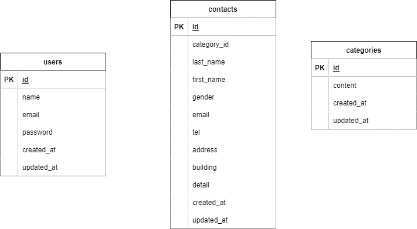

#アプリケーション名  
FashionablyLate(お問い合わせフォーム)

##作成した目的  
Advance テスト提出のため

##機能一覧

- お問い合わせ作成画面
  - バリデーション機能
- 確認画面
  - 修正ボタン(作成画面への遷移)
- サンクスページ
  - ボタンクリックでお問い合わせ作成画面へ遷移
- 管理画面
  - 検索機能
    - 名前での検索
    - メールアドレスでの検索
    - 性別での検索
    - お問い合わせの種類での検索
    - 日付での検索(日付をクリックすると、指定日とその前のデータを表示)
    - リセットボタンをクリックすると、初期状態に戻る
  - 削除機能
- ログイン画面
  - ログインしたユーザーのみが、管理画面を閲覧できる
- 新規登録画面

##使用技術

- Laravel 8.x
- PHP 7.4.9
- MySQL 8.0.26

##テーブル設計

contacts テーブル

| カラム名    | 型              | 説明                         |
| ----------- | --------------- | ---------------------------- |
| id          | bigint unsigned | 主キー                       |
| category_id | bigint unsigned | 外部キー                     |
| last_name   | varchar(255)    | 姓                           |
| first_name  | varchar(255)    | 名                           |
| gender      | tinyint         | 性別(1.男性 2.女性 3.その他) |
| email       | varchar(255)    | メールアドレス               |
| tel         | varchar(255)    | 電話番号                     |
| address     | varchar(255)    | 住所                         |
| building    | varchar(255)    | 建物名(NULL 許容)            |
| detail      | text            | お問い合わせ内容             |
| created_at  | timestamp       | 作成日(NULL 許容)            |
| updated_at  | timestamp       | 更新日(NULL 許容)            |

categories テーブル

| カラム名   | 型              | 説明               |
| ---------- | --------------- | ------------------ |
| id         | bigint unsigned | 主キー             |
| content    | varchar(255)    | お問い合わせの種類 |
| created_at | timestamp       | 作成日(NULL 許容)  |
| updated_at | timestamp       | 更新日(NULL 許容)  |

users テーブル

| カラム名   | 型              | 説明              |
| ---------- | --------------- | ----------------- |
| id         | bigint unsigned | 主キー            |
| name       | varchar(255)    | 名前              |
| email      | varchar(255)    | メールアドレス    |
| password   | varchar(255)    | パスワード        |
| created_at | timestamp       | 作成日(NULL 許容) |
| updated_at | timestamp       | 更新日(NULL 許容) |

##ER 図

##環境構築

- Docker ビルド

  1. git clone git@github.com:coachtech-material/laravel-docker-template.git
  2. docker-compose up -d --build

- Docker 環境構築

  1. docker-compose exec php bash
  2. composer install
  3. .env.example ファイルから.env を作成し、環境変数を変更
  4. php artisan key:generate
  5. php artisan migrate
  6. php artisan db:seed

##URL

- 開発環境:http://localhost/
- phpMyAdmin:http://localhost:8080/
